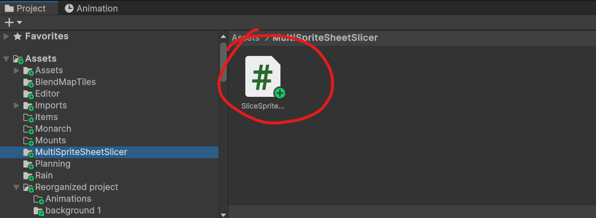

# Slice Sprite Sheets

This Unity editor tool allows you to easily slice sprite sheets into individual sprites, with various options for controlling the slicing process and pivot positions. The tool supports both PNG and TGA sprite sheet formats.

## Demo

Here's a quick demo showcasing the tool in action:

## Features

- Slice sprite sheets based on cell count or cell size
- Set custom pivot positions or choose from preset pivot points
- Choose between normalized or pixel-based pivot units
- Auto-refresh feature to automatically update the selected sprite sheets
- Supports folders or individual sprite sheet files as input

## Installation

1. Clone or download the repository to your local machine.

2. Navigate to the project folder and open the Unity project.

3. The `SliceSpriteSheets.cs` script should be located in the `MultiSpriteSheetSlicer` folder.

   

## Usage

1. Open the Slice Sprite Sheets window by navigating to `Tools` > `Slice Sprite Sheets` in the Unity editor menu.

    

2. Select the sprite sheet(s) you want to slice. You can either select individual sprite sheet files or a folder containing sprite sheets.

3. Adjust the slicing options as needed:
   - **Slice Mode**: Choose between slicing based on cell count or cell size.
   - **Cells Per Row/Column**: Set the number of cells per row and column when using the cell count mode.
   - **Cell Width/Height**: Set the width and height of each cell when using the cell size mode.
   - **Pivot Preset**: Select from preset pivot positions or choose a custom pivot position.
   - **Pivot Unit Mode**: Choose between normalized (0-1 range) or pixel-based pivot units.
   - **Auto Refresh**: Enable or disable auto-refresh, which automatically updates the selected sprite sheets based on the specified refresh interval.

4. Click the "Slice Selected Sprite Sheets" button to slice the selected sprite sheets.

5. The sliced sprites will be imported into the project, and you can find them in the respective sprite sheet folder(s).

## Contributing

Contributions are welcome! If you have any improvements, bug fixes, or additional features to suggest, please open an issue or submit a pull request.

## License

This project is licensed under the [MIT License](LICENSE).